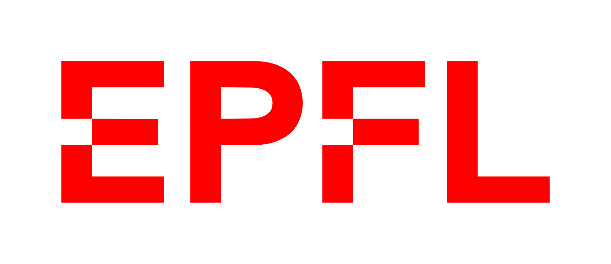

# End of the World

_An interactive film project for École Polytechnique Fédérale de Lausanne._

This repository contains the code for "End of the World", a small interactive film project developed as part of the course "Myths of the Ancient Mediterranean Sea" at EPFL.

The project is implemented using Svelte, a modern JavaScript framework for building user interfaces. It provides an interactive film experience where the correct video sequence is played automatically, after which a list of choices on how to continue is displayed, allowing the viewer to influence the narrative.

## Getting Started

This project is designed to be deployed on Vercel. It can also be built using `adapter-static` or `adapter-node` to run locally or on a VPS.

Media can either be served from the `static/media` assets directory, or hosted on another domain using an external service. It's recommended to use a service without egress fees, such as Cloudflare's R2 object storage.

### Prerequisite

To get a local copy of the project up and running on your machine, follow these steps:

1. Clone this repository to your local machine using the following command:

```shell
git clone https://github.com/MarcusCemes/hum-452-myths-project.git
cd hum-452-myths-project
```

2. Install the dependencies using pnpm:

```shell
pnpm install
```

### Starting the development server

Once you have cloned the repository and installed the dependencies, you can start the development server with the following command:

```shell
pnpm dev
```

This will launch the application on a local development server. You can access it by opening your web browser and visiting `http://localhost:5173`.

To set an external domain for media assets, set the `VITE_MEDIA_URL` environment variable. This can be done using the `.env` file. If deploying to Vercel, remember to also set this variable in their interface, as it gets hard-coded into the generated code during build time.

### Building

To build the project, run the following command:

```shell
pnpm build
```

If deploying to Vercel, this will be run automatically.

## License

This project is licensed under the [MIT License](LICENSE). You are free to modify and distribute the code, but remember to include the original license file.

<br />
<div align="center">
    <a href="https://epfl.ch"></a>
</div>
